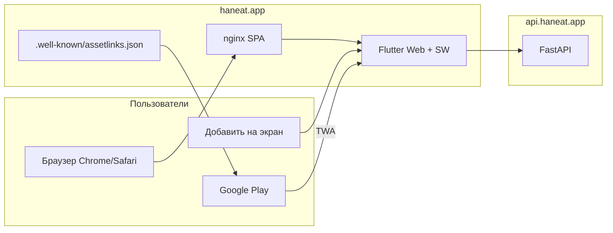

# Релиз Web (PWA) + Google Play

Стратегия: **одна кодовая база Flutter Web** → пользователи ставят на рабочий стол как PWA; в Google Play — либо **TWA** (обёртка над тем же URL), либо **нативный AAB** (уже есть `build_android_release.sh`).

## Архитектура



| Канал | Что ставит пользователь | Сборка |
|-------|-------------------------|--------|
| **Web PWA** | Иконка на домашний экран (Chrome, Safari, Samsung) | `build_web_release.sh` |
| **Play TWA** | APK/AAB из Play, внутри — тот же `https://haneat.app` | Bubblewrap + assetlinks |
| **Play native** | Полноценное Flutter-приложение | `build_android_release.sh` |

Для v1 разумно: **PWA везде в браузере** + **TWA в Play** (быстрее, один деплой веба). Нативный AAB оставляем для функций, которых нет на web (push FCM, контакты, камера в фоне).

---

## Что уже готово в репозитории

- `web/manifest.json` — `standalone`, maskable-иконки, `scope` / `start_url`
- `web/index.html` — viewport, theme-color, splash-фон `#FAFAF8`
- `scripts/build_web_release.sh` — release + `--pwa-strategy offline-first`
- `scripts/pre_web_release_check.sh` — чеклист перед деплоем
- `scripts/deploy_web_timeweb.sh` — rsync на сервер
- `scripts/setup_nginx_haneat_web.sh` — nginx для SPA + assetlinks
- `scripts/generate_assetlinks.sh` — Digital Asset Links для TWA
- В коде: `kIsWeb` отключает push, контакты, dotenv; загрузка файлов через `bytes`

---

## Фаза 1 — DNS и хостинг

1. DNS у регистратора `haneat.app`:
   - `A @` → IP сервера (тот же Timeweb, что `api.haneat.app`, или отдельный)
   - `A www` → тот же IP (или CNAME на `@`)
2. На сервере (консоль Timeweb):

```bash
bash /root/HAN-Eat/scripts/setup_nginx_haneat_web.sh
certbot --nginx -d haneat.app -d www.haneat.app
```

3. Проверка:

```bash
curl -sI https://haneat.app/ | head -3
dig +short haneat.app
```

Backend уже разрешает CORS: `ALLOWED_ORIGINS` включает `https://haneat.app` (см. `deploy_timeweb_server.sh`).

---

## Фаза 2 — Сборка и деплой PWA

```bash
# Локальные проверки
./scripts/pre_web_release_check.sh

# Release-сборка (API prod + Google OAuth из .env)
./scripts/build_web_release.sh https://api.haneat.app

# Деплой на сервер
bash scripts/deploy_web_timeweb.sh
```

Локальный просмотр без деплоя:

```bash
./scripts/build_web_release.sh
cd build/web && python3 -m http.server 8080
# открыть http://127.0.0.1:8080
```

---

## Фаза 3 — Google Sign-In на web

1. [Google Cloud Console](https://console.cloud.google.com/) → OAuth 2.0 → Web client
2. **Authorized JavaScript origins:**
   - `https://haneat.app`
   - `https://www.haneat.app`
   - `http://localhost` (dev)
3. В корневом `.env`:

```env
GOOGLE_WEB_CLIENT_ID=xxxx.apps.googleusercontent.com
```

4. `load_dart_defines.sh` подставит `--dart-define=GOOGLE_WEB_CLIENT_ID=...` при сборке.
5. Проверка: `./scripts/verify_google_signin.py`

Подробнее: [GOOGLE_SIGNIN_SETUP.md](GOOGLE_SIGNIN_SETUP.md)

---

## Фаза 4 — «Добавить на рабочий стол»

### Android (Chrome)

1. Открыть `https://haneat.app`
2. Меню → **Установить приложение** / баннер «Добавить на главный экран»
3. После установки: полноэкранный режим (`display: standalone`), без адресной строки

### iOS (Safari)

1. Поделиться → **На экран «Домой»**
2. `apple-mobile-web-app-capable` уже в `index.html`
3. Safe area: приложение использует `SafeArea` в shell — notch учитывается

### Критерии приёмки PWA

- [ ] Lighthouse PWA: installable, manifest OK
- [ ] Первая загрузка &lt; 15 с на 4G (CanvasKit)
- [ ] Повторный запуск с иконки — без белого/чёрного экрана &gt; 3 с
- [ ] Офлайн: shell грузится (service worker), API показывает баннер «нет сети»
- [ ] Нет ошибок CORS в консоли

Smoke: [LAUNCH_SMOKE.md](LAUNCH_SMOKE.md) → раздел **Web**.

---

## Фаза 5 — Google Play

### Вариант A: Trusted Web Activity (рекомендуется для web-first)

Один URL в Play, обновления — только деплой веба.

1. Сгенерировать asset links (нужен upload-keystore):

```bash
./scripts/generate_assetlinks.sh
./scripts/build_web_release.sh
bash scripts/deploy_web_timeweb.sh
```

2. Сгенерировать Android-обёртку (один раз):

```bash
./scripts/build_twa_release.sh setup
```

3. Собрать AAB для Play:

```bash
./scripts/build_twa_release.sh build
# AAB: android-twa/app/build/outputs/bundle/release/app-release.aab
```

Подпись берётся из `android/key.properties` (тот же keystore, что и нативный AAB).

4. Проверить:

```bash
curl -s https://haneat.app/.well-known/assetlinks.json
```

3. Установить [Bubblewrap](https://github.com/GoogleChromeLabs/bubblewrap):

```bash
npm install -g @bubblewrap/cli
bubblewrap init --manifest https://haneat.app/manifest.json
# package: com.haneat.app, signing: android/upload-keystore.jks
bubblewrap build
```

4. Play Console:
   - Создать приложение `com.haneat.app` (если ещё нет)
   - Internal testing → загрузить `app-release-signed.apk` или AAB от bubblewrap
   - Data safety, content rating
   - Privacy: `https://haneat.app/privacy`
   - Terms: `https://haneat.app/terms`
   - Скриншоты: с телефона в standalone / TWA

5. [Digital Asset Links](https://developer.android.com/training/sign-in/google-sign-in#add-scope): статус «verified» в Play Console → Setup → App integrity.

### Вариант B: Нативный Flutter AAB

Если нужны FCM push, контакты, нативная камера без ограничений web:

```bash
./scripts/build_android_release.sh https://api.haneat.app
# AAB: build/app/outputs/bundle/release/app-release.aab
```

Можно публиковать **оба** (TWA lite + native full) под разными listing или выбрать один.

---

## Фаза 6 — Что отключено / ограничено на web

| Функция | Web | Обход |
|---------|-----|-------|
| Push FCM | нет | email / in-app; позже Web Push |
| Контакты телефона | нет | ручной поиск пользователей |
| Запись видео в фоне | ограничено | галерея / file picker |
| Deep links `haneat://` | нет | URL `https://haneat.app/...` (go_router) |
| AI scan камера | file picker | работает |
| `.env` локально | нет | `--dart-define` при сборке |

---

## Полный чеклист перед релизом

```bash
RUN_PROD_SMOKE=1 ./scripts/release_all_checks.sh
./scripts/pre_web_release_check.sh
./scripts/build_web_release.sh https://api.haneat.app
bash scripts/deploy_web_timeweb.sh
```

Ручной smoke на устройстве:

- [ ] Гость: лента, каналы
- [ ] Google Sign-In
- [ ] Чаты (текст, фото)
- [ ] Создание поста с фото
- [ ] Подписка: «Оплата скоро»
- [ ] Privacy / Terms открываются
- [ ] Установка на домашний экран → повторный запуск
- [ ] (TWA) Запуск из Play → тот же UI, без браузерной панели

---

## Частые проблемы

| Симптом | Решение |
|---------|---------|
| Чёрный экран при загрузке | Фон в `index.html` + дождаться CanvasKit; проверить CDN не блокируется |
| Google Sign-In `origin_mismatch` | Добавить `https://haneat.app` в OAuth origins |
| CORS | `ALLOWED_ORIGINS` на backend |
| TWA открывает Chrome с URL-bar | assetlinks.json не verified или другой signing key |
| 404 на `/recipe/123` после refresh | nginx `try_files ... /index.html` (см. setup script) |
| Старый SW после деплоя | hard refresh; SW version обновляется при `flutter build web` |

---

## Связанные документы

- [RELEASE_V1_NO_PAYMENT.md](RELEASE_V1_NO_PAYMENT.md) — общий релиз без оплаты
- [LAUNCH_SMOKE.md](LAUNCH_SMOKE.md) — smoke web + mobile
- [LEGAL_PAGES_DEPLOY.md](LEGAL_PAGES_DEPLOY.md) — privacy/terms
- [DEPLOY_TIMEWEB.md](DEPLOY_TIMEWEB.md) — backend API
